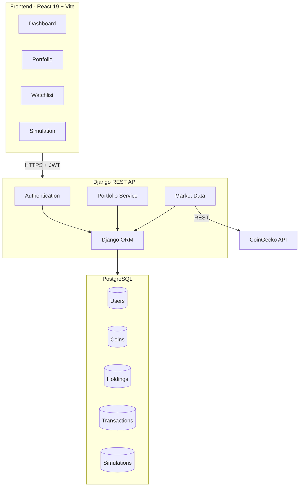
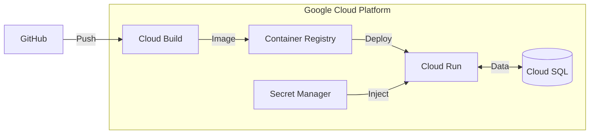

# CryptoDash

A cryptocurrency portfolio management and trading simulation platform designed for beginners to learn crypto trading without financial risk.

**Live Demo**: [https://cryptodash-404454446141.us-central1.run.app](https://cryptodash-404454446141.us-central1.run.app)

## Problem Statement

The cryptocurrency market presents significant barriers for newcomers:

- **High Risk of Loss**: Beginners often lose money learning to trade with real funds
- **Complex Interfaces**: Most trading platforms are overwhelming for new users
- **Information Overload**: Difficult to track portfolios across multiple exchanges
- **No Safe Practice Environment**: Limited options to practice trading strategies risk-free

CryptoDash solves these problems by providing a **sandbox environment** where users can:
- Practice trading with simulated portfolios
- Track watchlists and monitor market trends
- Learn trading strategies without risking real money
- Understand portfolio management fundamentals

## Architecture



## Security & Reliability

### Authentication
- **JWT Tokens**: Short-lived access tokens (15 min) with rotating refresh tokens (7 days)
- **Password Hashing**: PBKDF2 with SHA256 (720,000 iterations)
- **reCAPTCHA v2**: Bot prevention on login and registration
- **Session Management**: Secure cookie handling with SameSite protection

### Data Protection
- **CSRF Protection**: Cross-Site Request Forgery prevention on all state-changing operations
- **CORS Configuration**: Strict origin validation for API requests
- **Input Validation**: Server-side validation on all user inputs via Django REST Framework serializers
- **SQL Injection Prevention**: Parameterized queries through Django ORM

### Password Security
- Minimum 8 characters required
- Must contain uppercase, lowercase, numbers, and special characters
- Password similarity check against user attributes
- Common password dictionary validation

### Infrastructure
- **HTTPS Only**: SSL/TLS encryption in transit
- **Environment Variables**: Secrets stored securely, never in code
- **Cloud Run**: Auto-scaling, managed infrastructure with built-in DDoS protection

## Tech Stack

| Layer | Technology |
|-------|------------|
| Frontend | React 19, Vite, Tailwind CSS, DaisyUI |
| Backend | Django 5.2, Django REST Framework |
| Database | PostgreSQL (Production), SQLite (Development) |
| Authentication | JWT (SimpleJWT), Google reCAPTCHA |
| Market Data | CoinGecko API |
| Deployment | Google Cloud Run |

## Features

- **Portfolio Management**: Track holdings, view profit/loss, manage positions
- **Trading Simulation**: Practice buy/sell without real money
- **Watchlist**: Monitor favorite cryptocurrencies
- **Market Data**: Real-time prices for top 100 cryptocurrencies
- **Price Charts**: Historical price visualization
- **User Preferences**: Customizable currency, timezone, date format

## Local Development

### Prerequisites
- Python 3.11+
- Node.js 18+
- npm

### Quick Start
```bash
# Clone the repository
git clone https://github.com/pranavanand2026-design/learning_crypto.git
cd learning_crypto

# Create virtual environment
python3 -m venv venv
source venv/bin/activate

# Run the application
python run.py
```

This will:
1. Install Python dependencies
2. Run database migrations
3. Install frontend dependencies
4. Start backend server (http://localhost:8000)
5. Start frontend dev server (http://localhost:5173)

## Deployment

The application is deployed on **Google Cloud Run**, a fully managed serverless platform that automatically scales containers based on traffic.

### Deployment Architecture


### Key Deployment Features
- **Multi-stage Docker Build**: Frontend compiled with Node.js, served by Django with WhiteNoise
- **Zero-downtime Deployments**: New revisions deploy without service interruption
- **Auto-scaling**: Scales from 0 to N instances based on request volume
- **Managed SSL**: HTTPS certificates automatically provisioned and renewed
- **Environment Isolation**: Secrets injected at runtime via environment variables

### Build Process
```bash
# Build and deploy with Cloud Build
gcloud builds submit --tag gcr.io/PROJECT_ID/cryptodash
gcloud run deploy cryptodash --image gcr.io/PROJECT_ID/cryptodash --platform managed
```

## API Documentation

See [APIDocumentation.md](./APIDocumentation.md) for detailed endpoint specifications.

## Team

- **Pranav Anand** - Frontend Development, Scrum Master
- **Muhammad Abdullah** - Backend Development, Database
- **Suryansh Shekhawat** - Backend Development, Testing
- **Ellis Mon** - Frontend Development, Database
- **Elvern Keefe Chen** - Frontend Development, Testing

## License

This project was developed as part of ELEC3609/ELEC9609 at the University of Sydney.
